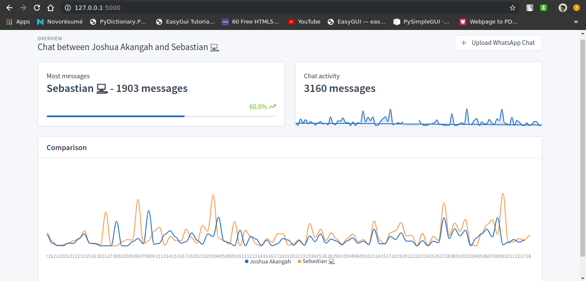
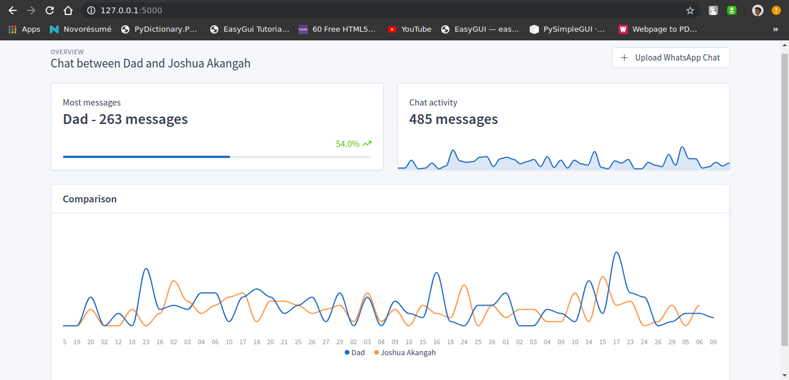
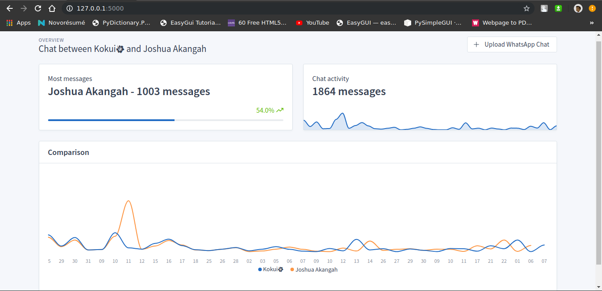

# vatzapp
Visualize whatsapp chat data to get stats

Strange name Vatzapp. Visualize WhatsApp. Vatzapp. Get it? Horrible at naming things.

# How to use
Export a chat between you and another person in WhatsApp as a text file

# Group chats are not currently supported 

Include the absolute path to the txt file in the functions.py file

Like
```python
with open('path/to/file.txt') as file:
  data = file.read()
```

# Todo
__*Code Cleanup. A lot.*__

# Examples



